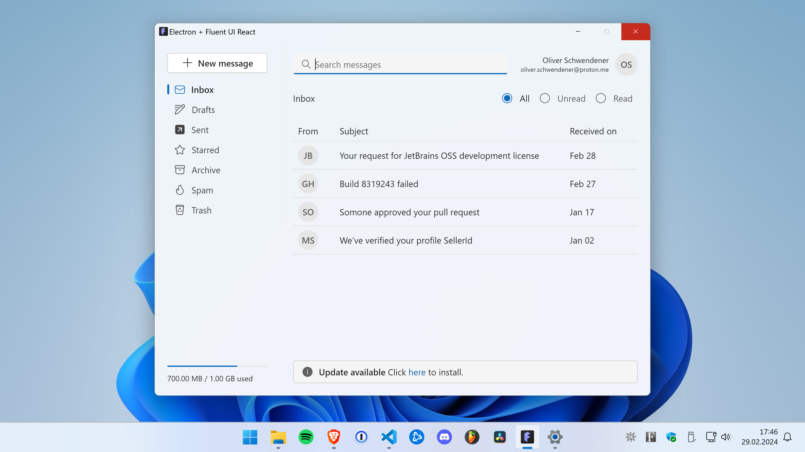
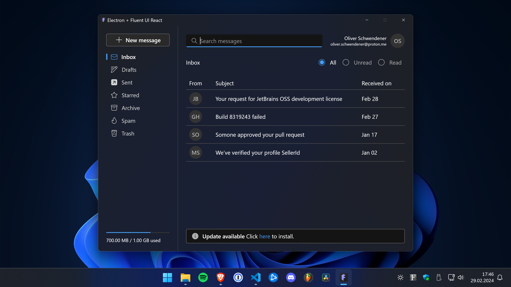
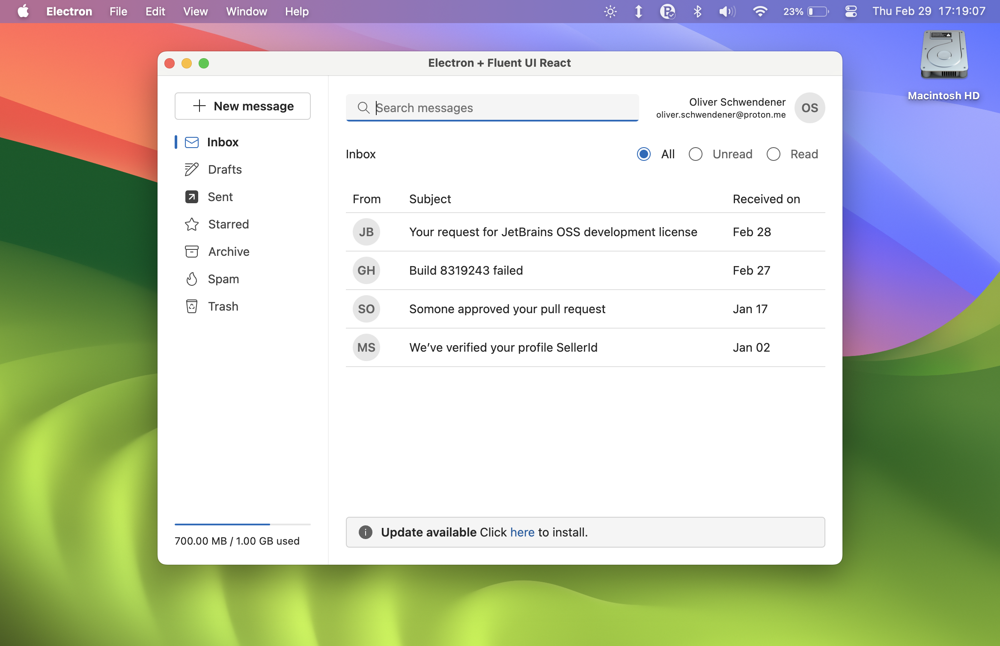
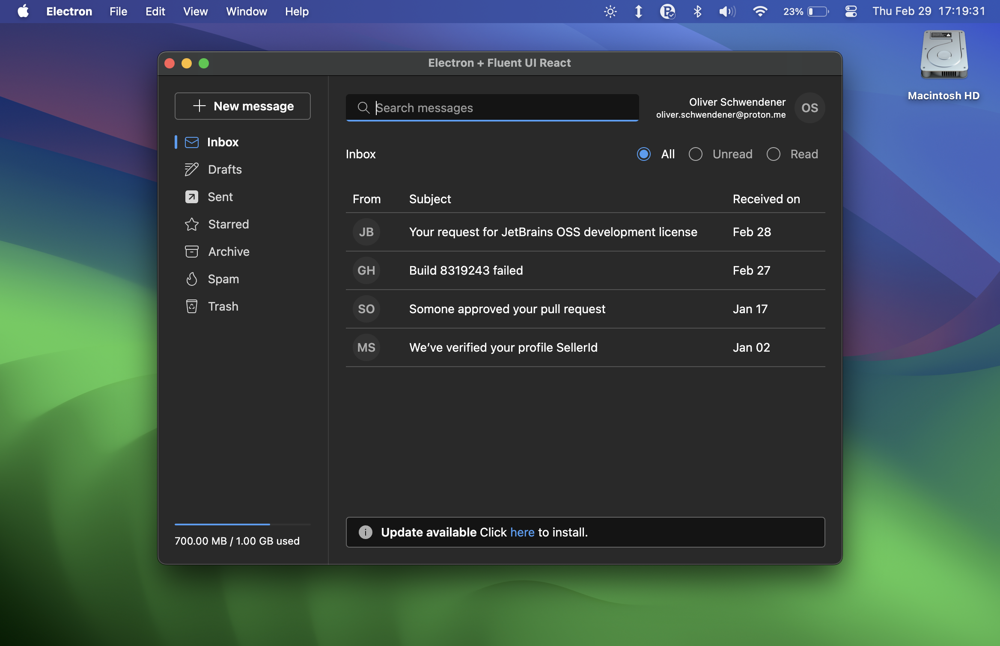

# Electron + Fluent UI React

This is a repo to quickly start the development of an electron application with [Fluent UI React](https://react.fluentui.dev/).






## Development

-   Install dependencies

    ```
    $ npm install
    ```

-   Run app in dev mode

    ```
    $ npm run dev
    ```

-   Lint files

    ```
    $ npm run lint
    ```

-   Perform typecheck

    ```
    $ npm run typecheck
    ```

-   Run tests

    ```
    $ npm run test
    ```

-   Build and package app

    ```
    $ npm run build && npm run package
    ```
